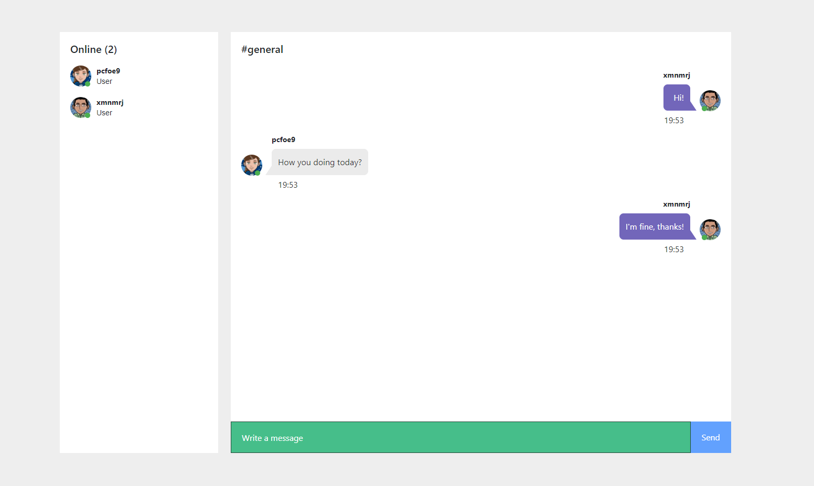

# Simple Chat App created with Vue.js and Node.js(Socket.io)



# Client (Vue)

## Project setup
```
npm install
```

### Compiles and hot-reloads for development
```
npm run serve
```

### Compiles and minifies for production
```
npm run build
```

### Run your tests
```
npm run test
```

### Lints and fixes files
```
npm run lint
```

# Server (Node)

## Project setup
```
npm install
```

### Run server with nodemon
```
npm run dev
```

### Run server with node
```
node index.js
```